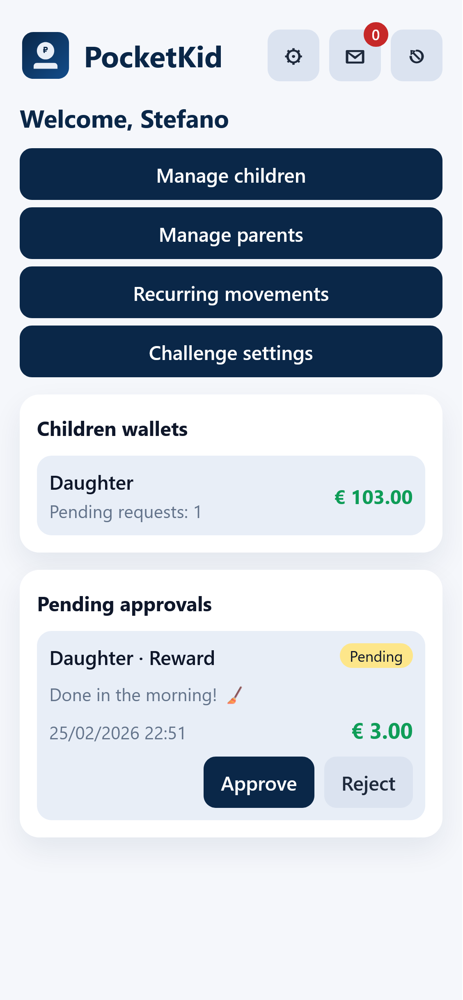
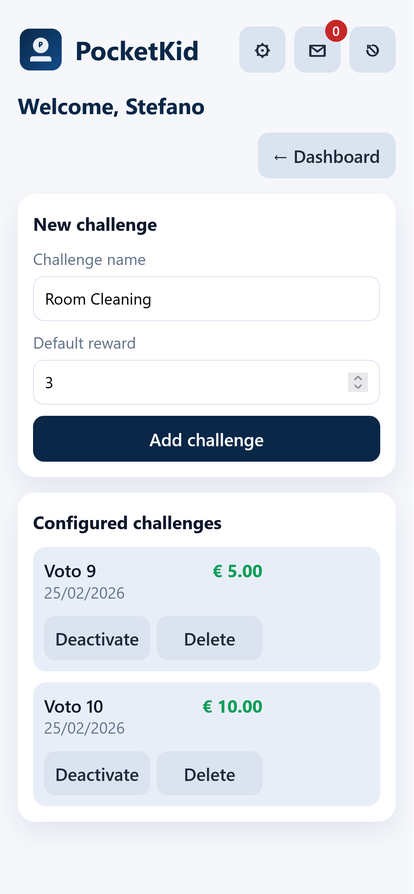
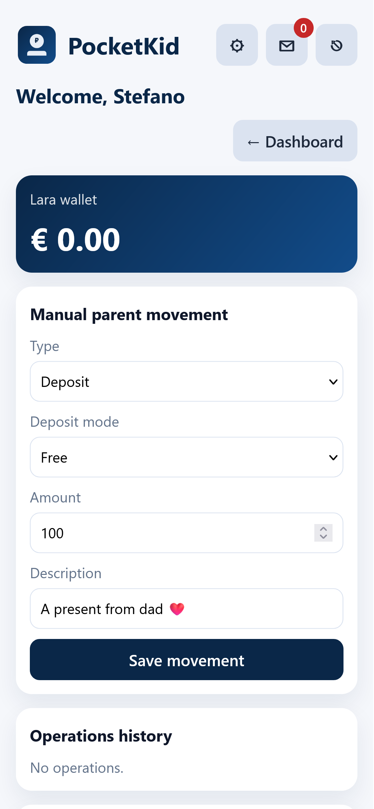
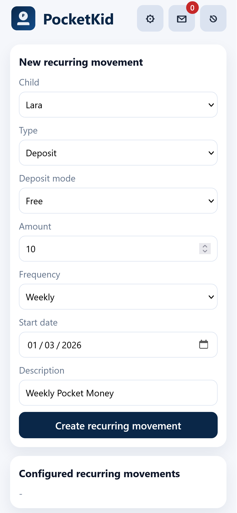
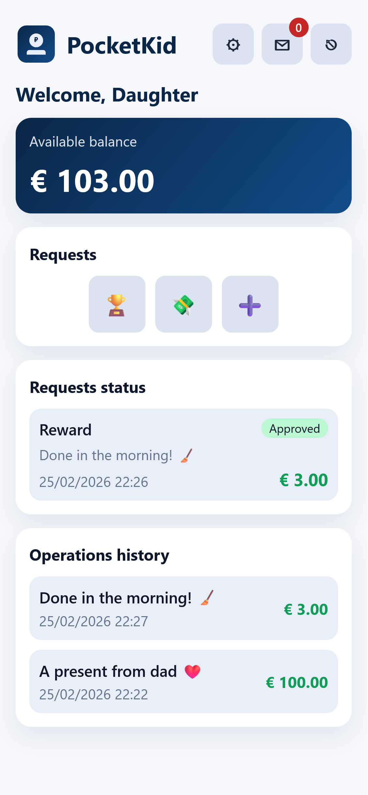
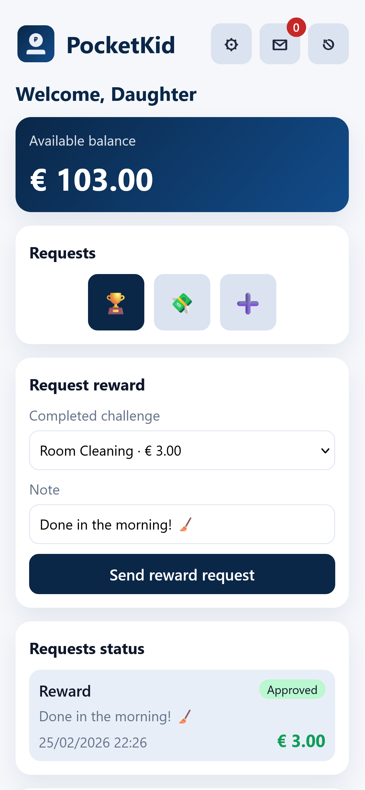

# 1. PocketKid

PocketKid is a mobile-first Python PWA to manage a virtual wallet for your children.
It helps parents organize pocket money through configurable challenges and a complete request approval flow.

Public repository:
- https://github.com/pernastefano/pocketkid

Parents and children access the same app with role-based features:
- Children can submit reward requests linked to challenges, plus withdrawal and generic deposit requests.
- Parents can approve/reject requests, perform manual wallet movements, configure recurring movements, manage users, and review full history.

The app is installable as a Progressive Web App (PWA) and supports real Web Push notifications (VAPID) for system-level alerts.

## Screens

<p>
  <a href="screens/parent-dashboard.png"></a>
  <a href="screens/challenge-config.png"></a>
  <a href="screens/parent-deposit.png"></a>
</p>
<p>
  <a href="screens/recurring-config.png"></a>
  <a href="screens/child-dashboard.png"></a>
  <a href="screens/child-request.png"></a>
</p>

---

# 2. Stack

PocketKid uses a simple, production-friendly stack:

- **Backend**: Python + Flask
  - Server-side rendered pages
  - Session-based authentication
  - Role-based access (parent/child)
  - Production container runtime via Gunicorn
- **Database**: SQLite (local file under `data/`)
- **ORM**: Flask-SQLAlchemy
- **Frontend**:
  - Jinja templates
  - Custom CSS (mobile-first layout)
  - Vanilla JavaScript for dynamic UI, polling, auto-refresh, and push registration
- **PWA Layer**:
  - Web App Manifest
  - Service Worker (offline static caching + push event handling)
- **Notifications**:
  - In-app notifications
  - Real Web Push (VAPID) via `pywebpush`
- **Containerization**:
  - Docker + Docker Compose
- **Internationalization (i18n)**:
  - English + Italian locale files
  - Per-user preferred language setting

---

# 3a. Local Run

## Prerequisites
- Python 3.12+
- `pip`

## Steps
```bash
cp .env.example .env
# edit .env with VAPID_PUBLIC_KEY and VAPID_PRIVATE_KEY (or VAPID_PRIVATE_KEY_B64)
python -m venv .venv
source .venv/bin/activate
pip install -r requirements.txt
python app.py
```

Open:
- `http://localhost:8000`

## First Boot Behavior
- No demo users are auto-created.
- The app opens the setup screen to create the first parent account.
- You can optionally create the first child during setup.

---

# 3b. Run with Docker

## Build image
```bash
docker build -t pocketkid .
```

## Run container
Before running, provide VAPID keys via environment variables:

```bash
cp .env.example .env
# edit .env with real VAPID_PUBLIC_KEY and VAPID_PRIVATE_KEY (or VAPID_PRIVATE_KEY_B64)
```

```bash
docker run --rm \
  --env-file .env \
  -p 8000:8000 \
  -v $(pwd)/data:/app/data \
  pocketkid
```

Open:
- `http://localhost:8000`

---

# 3c. Run with Docker Compose

Prepare env file first:
```bash
cp .env.example .env
# edit .env with real VAPID keys
# optional: set host user/group for container process
# PUID=1000
# PGID=1000
```

```bash
docker compose up -d --build
```

The default compose file:
- maps port `8000`
- persists app data in `./data`
- restarts container automatically (`unless-stopped`)
- supports optional `PUID`/`PGID` to run the container as a specific host UID/GID (default `1000:1000`)

---

# 4. Main Features and How It Works

## Roles

### Parent
- Manage children (create/delete with double confirmation)
- Manage other parents (create/delete with safety constraints)
- Configure challenges with predefined reward amounts
- Review and approve/reject pending child requests
- Execute manual wallet movements (deposit/withdrawal)
- Create recurring movements with configurable frequency:
  - daily
  - weekly
  - biweekly
  - monthly
- Reset child passwords
- Configure personal language and password

### Child
- View wallet balance and operation history
- Submit reward request (linked to configured challenge)
- Submit withdrawal request
- Submit generic deposit request
- Change personal language and password

## Wallet Request Workflow
1. Child submits a request (reward / withdrawal / deposit).
2. Parent receives notification and sees pending request.
3. Parent approves or rejects:
   - **Approve reward/deposit** → wallet increases.
   - **Approve withdrawal** → wallet decreases (if sufficient balance).
   - **Reject** → request state updates to rejected.
4. Transaction is saved in history and notifications are generated.

## Notifications and Auto-Refresh
- In-app notifications are available in the top-right mail icon.
- System notifications are sent via Web Push when supported.
- Pages auto-refresh on incoming events to keep dashboards synchronized without manual actions.

## PWA and Offline Behavior
- Static assets are cached by the Service Worker.
- Navigation is network-first to avoid stale pages after submit/approval actions.

---

# 5. SSL Configuration

HTTPS is required for full PWA + Push behavior in real devices/environments (except localhost during development).

## Why SSL is required
- Service Worker reliability in production
- Web Push delivery on iOS/Android/browser
- Proper installability and secure context

## Recommended production setup
Use a reverse proxy with TLS termination (Nginx/Caddy/Traefik) in front of the Flask app/container.

Example architecture:
- `https://your-domain` → reverse proxy (TLS certificate)
- proxy forwards to PocketKid (Gunicorn) on internal port `8000`

## VAPID keys (environment-based)
PocketKid reads VAPID keys from environment variables:
- `VAPID_PUBLIC_KEY` (required)
- `VAPID_PRIVATE_KEY` (required if `VAPID_PRIVATE_KEY_B64` is not set)
- `VAPID_PRIVATE_KEY_B64` (optional alternative to `VAPID_PRIVATE_KEY`)
- `VAPID_SUBJECT` (optional, default: `mailto:pocketkid@example.com`)

For Docker, set these in `.env` and load them via `--env-file` or Docker Compose.

---

# 6. Install PWA on iOS and Android

## iOS (Safari)
1. Open the app URL in Safari.
2. Tap **Share**.
3. Tap **Add to Home Screen**.
4. Confirm installation.

Notes:
- Push notifications on iOS require HTTPS and supported iOS versions.
- User must allow notification permissions.

## Android (Chrome/Edge)
1. Open the app URL.
2. Tap browser menu.
3. Tap **Install app** / **Add to Home screen**.
4. Confirm installation.

Notes:
- Push notifications require HTTPS in production.
- User must grant notification permission.

---

## Project Structure (Quick Reference)
- `app.py` → minimal application entrypoint
- `pocketkid/config.py` → configuration and paths
- `pocketkid/extensions.py` → shared extensions (SQLAlchemy)
- `pocketkid/models.py` → database models
- `pocketkid/services.py` → support/business utilities (auth helpers, i18n, push, recurring)
- `pocketkid/routes.py` → HTTP routes
- `pocketkid/__init__.py` → app factory and bootstrap
- `templates/` → UI views
- `static/` → CSS, JS, Service Worker, manifest, icons
- `locales/` → i18n files (`en.json`, `it.json`)
- `data/` → SQLite DB
- `.env.example` → template for VAPID environment variables
- `Dockerfile`, `docker-compose.yml` → container setup

---

## Credits
Stefano Perna

## License
This project is licensed under the MIT License. See the `LICENSE` file for details.
